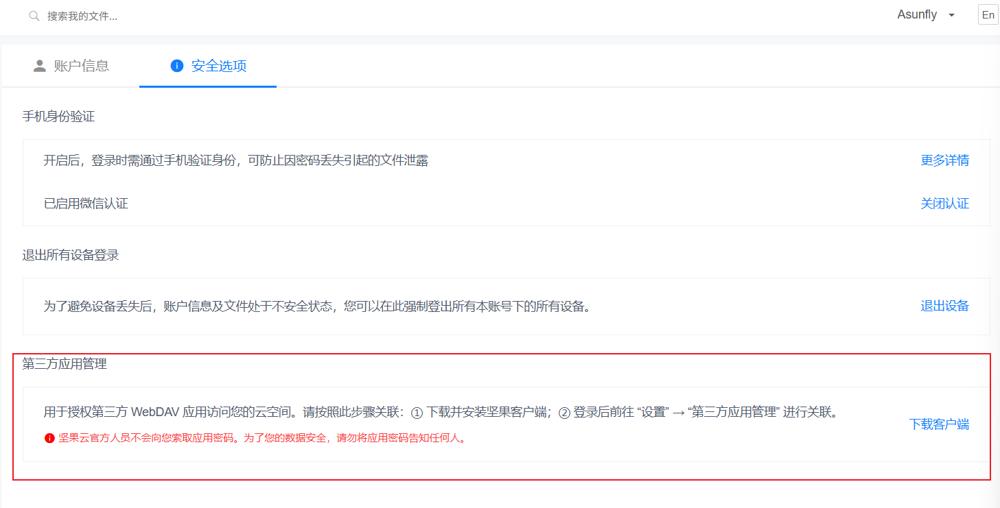
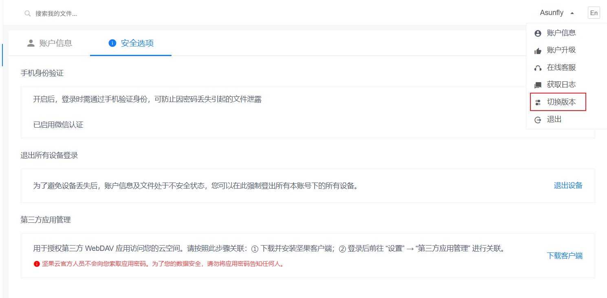
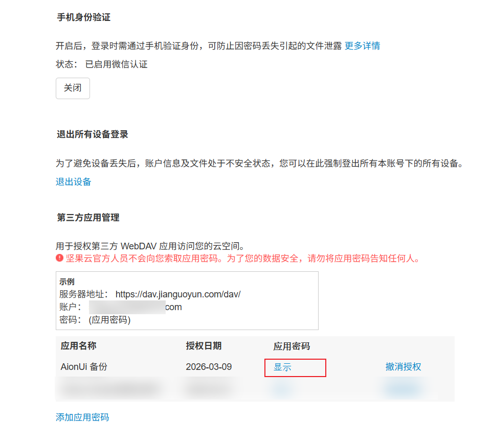
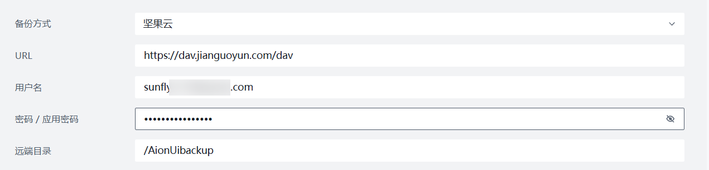

# AionUi × 坚果云备份：应用密码图文说明

AionUi 里那个“**查看坚果云 WebDAV 说明**”，看这篇就对了。

先记住 3 句话：

- 请使用 **坚果云应用密码**，不要填写网页登录密码。
- 坚果云模式本质上还是标准 `WebDAV` 备份。
- `WebDAV` 地址固定为：`https://dav.jianguoyun.com/dav`

顺手再记一个：坚果云免费额度通常是每月 **`1G` 上传**、**`3G` 下载**。

## 1. 先注册并登录坚果云

登录地址：`https://www.jianguoyun.com/d/login`

没有账号就先注册，有账号就直接登录。

## 2. 进入第三方应用管理

登录后走这里：

`账号下拉` → `账号信息` → `安全选项` → `第三方应用管理`

## 3. 哎嗨，怎么提示下载客户端？

`nonono`，邪修才不管你这有的没的。

举起双手跟我做：

`账号下拉` → `切换版本`

然后再回去：

`账号信息` → `安全选项` → `第三方应用管理`

## 4. 添加应用密码

到了“第三方应用管理”以后，点击：

`添加应用密码`

名字随便起，建议直接整一个：`AionUi yyds`

创建完成后，复制 **应用密码**。

别写错了：**这里要的是应用密码，不是网页登录密码。**

## 5. 回 AionUi 填上去

在 AionUi 里这样填：

- 备份方式：`坚果云`
- URL：`https://dav.jianguoyun.com/dav`
- 用户名：你的坚果云账号
- 密码 / 应用密码：刚刚复制的应用密码
- 远端目录：`/AionUibackup`

## 打完收工

一句话总结：

登录坚果云 → 找到 `第三方应用管理` → 如果让你下载客户端就先 `切换版本` → 添加 **应用密码** → 把 **账号 + 应用密码** 填到 AionUi。
