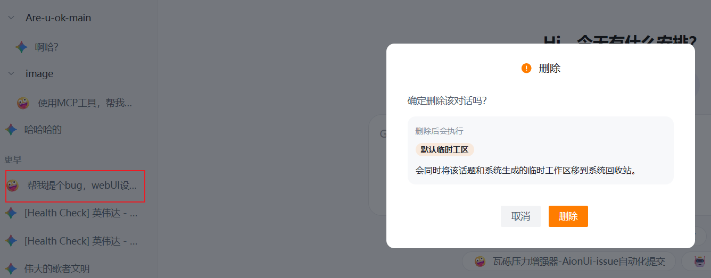
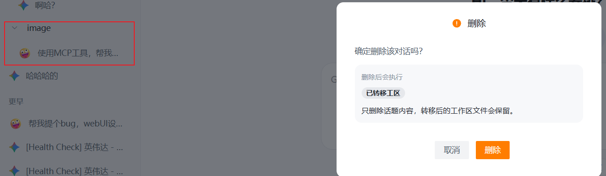
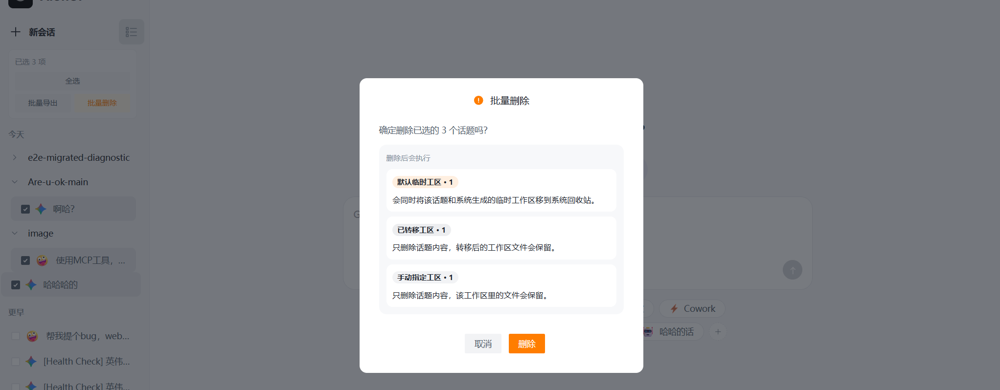
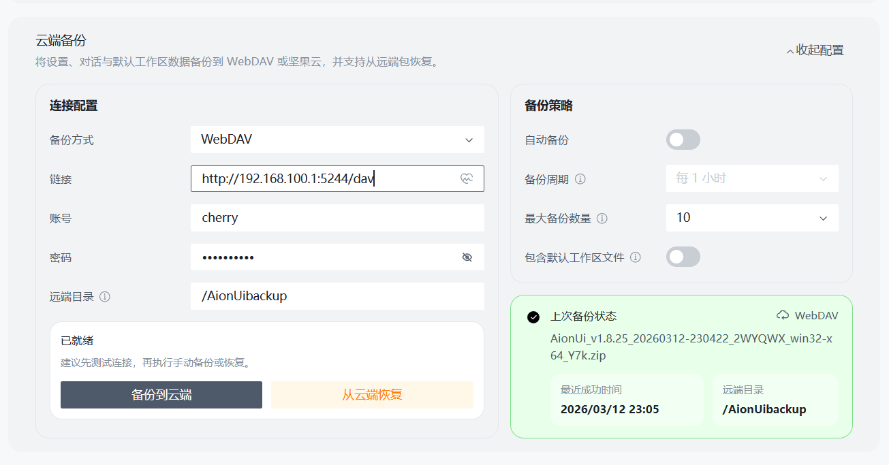
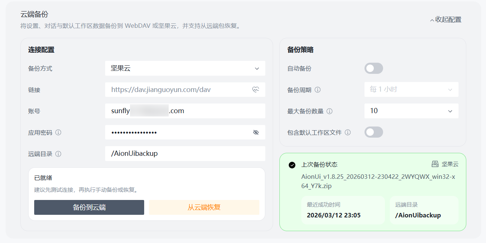
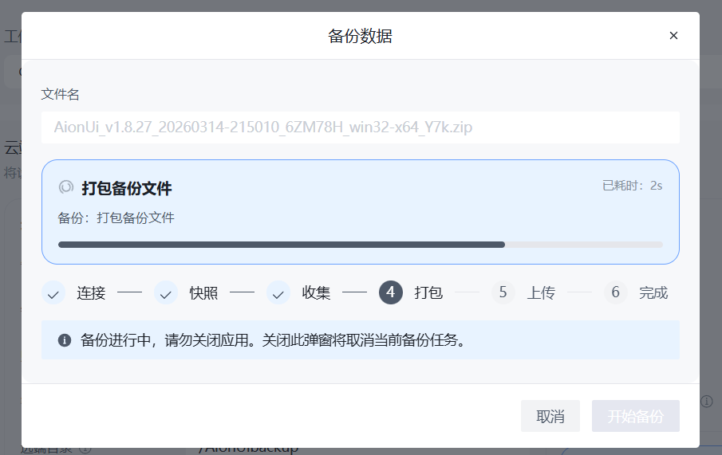
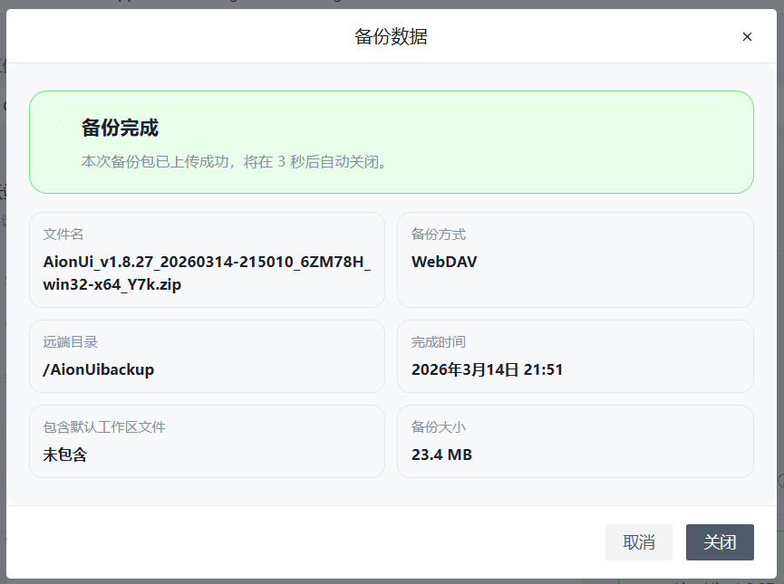
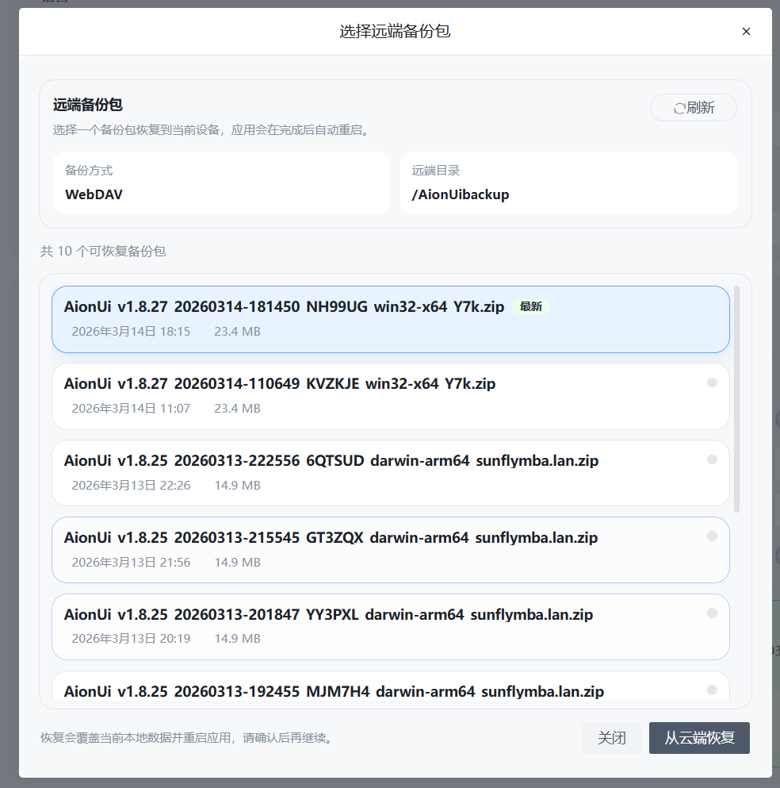
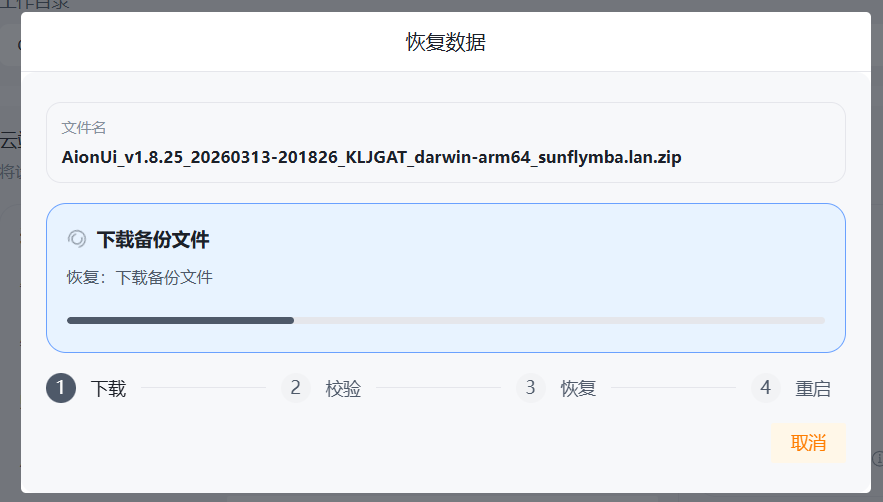
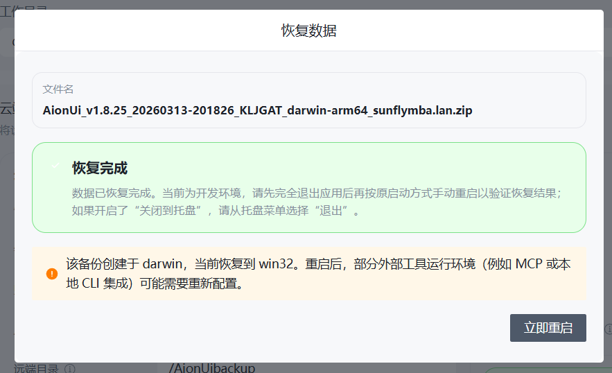

# 删除回收机制 + WebDAV 云端备份恢复 PR 提交稿

## 1. 用途说明

本文档用于整理一版适合提交到 `upstream/main` 的中文 PR 素材。

这次变更相对上游不是几个零散修复，而是两套完整的数据安全能力：

1. 话题删除回收机制
2. WebDAV / 坚果云云端备份与恢复机制

因此，PR 正文不建议写成“本次修复了某几个问题”，而应明确表述为：

- 新增删除回收能力
- 新增云端备份与恢复能力

---

## 2. 提交前要求

提交这次 PR 前，建议按下面的要求收口：

- PR 正文只保留高层功能说明、测试结论和截图，不把全部边界场景塞进正文
- 详细场景测试用例继续保留在 [2026-03-14-delete-trash-cloud-backup-review.md](/f:/vibecoding/aionui/AionUi/docs/plans/2026-03-14-delete-trash-cloud-backup-review.md)
- 提交范围里不要混入与这两个功能无关的文件
- 当前工作区中的 [ChatHistory.tsx](/f:/vibecoding/aionui/AionUi/src/renderer/pages/conversation/ChatHistory.tsx) 删除不建议进入这次上游 PR
- 内部工作底稿不要随 PR 一起提交：
  - [2026-03-14-delete-trash-cloud-backup-pr-draft.md](/f:/vibecoding/aionui/AionUi/docs/plans/2026-03-14-delete-trash-cloud-backup-pr-draft.md)
  - [2026-03-14-delete-trash-cloud-backup-review.md](/f:/vibecoding/aionui/AionUi/docs/plans/2026-03-14-delete-trash-cloud-backup-review.md)
  - `.codex-temp/*`
- 提交前补齐截图

---

## 3. 建议 PR 标题

优先推荐：

```md
feat(core): add trash-based deletion and WebDAV cloud backup restore
```

如果想强调数据安全，也可以用：

```md
feat(data): add trash-based delete flows and WebDAV/Nutstore backup recovery
```

---

## 4. 可直接提交的 PR 正文

下面这段可以直接作为上游 PR 的中文版本素材使用。

```md
## Summary

- 新增基于系统回收站/垃圾桶的话题删除回收机制，避免默认临时工区在删除话题时被直接不可逆清理
- 删除话题时区分默认临时工区、已转移工区和手动指定工区，并在确认弹窗中明确提示删除影响
- 新增 WebDAV / 坚果云云端备份与恢复能力，覆盖备份打包、远端保留策略、恢复校验、恢复失败回滚和恢复后重启确认链路
- 补充系统设置页入口、多语言文案、使用说明文档，以及对应的单元测试、DOM 测试和 E2E 测试

## Test plan

- [x] 运行删除回收相关单元测试
  - `bun run vitest tests/unit/deleteConversationData.test.ts tests/unit/trashService.test.ts tests/unit/fsBridgeRemoveEntry.test.ts tests/unit/legacyConversationStorage.test.ts`
- [x] 运行备份恢复相关单元 / DOM 测试
  - `bun run vitest tests/unit/cloudBackupModals.dom.test.tsx tests/unit/systemBackupNutstore.dom.test.tsx tests/unit/backupSchedulerService.test.ts tests/unit/backupService.test.ts tests/unit/applicationRestartBridge.test.ts`
- [x] 运行删除回收 E2E
  - `bun run test:e2e -- tests/e2e/specs/conversation-delete.e2e.ts`
- [x] 运行备份配置页 E2E
  - `bun run test:e2e -- tests/e2e/specs/cloud-backup-settings.e2e.ts`
- [x] 在本地 Electron 开发环境手动验证删除弹窗、备份配置面板和恢复结果态

详细功能场景与边界测试用例见：
`docs/plans/2026-03-14-delete-trash-cloud-backup-review.md`

## Screenshots

### 删除回收机制

- 默认临时工区话题删除确认弹窗
  - 
- 已转移工区话题删除确认弹窗
  - 
- 混合批量删除确认弹窗
  - 

### 云端备份与恢复

- WebDAV 配置面板
  - 
- 坚果云配置面板
  - 
- 恢复进度 / 恢复结果态
  - 
  - 
  - 
  - 
  - 

```

---

## 5. PR 正文里建议保留的表达方式

建议你在 PR 正文里保持这些原则：

- 强调这是相对 `upstream/main` 新增的两项桌面端数据安全能力
- 重点写用户价值，不写太多内部实现细节
- 测试部分只写高层测试结论和实际执行过的命令
- 边界场景通过补充文档引用，不在 PR 正文里逐条展开

建议的描述口径：

- 删除回收机制：强调“默认临时工区进入系统回收站，已转移和手动指定工区不误删”
- 云端备份恢复：强调“支持 WebDAV / 坚果云，恢复前校验，失败回滚，恢复后重启确认”

---

## 6. 建议保留到 upstream 的内容

### 6.1 必须保留

这些内容属于两大功能主链路，建议保留：

- 依赖与基础类型
  - `package.json`
  - `bun.lock`
  - `src/common/ipcBridge.ts`
  - `src/common/storage.ts`
  - `src/common/types/backup.ts`
  - `src/common/utils/backup.ts`
- 主进程 / bridge / service
  - `src/index.ts`
  - `src/process/bridge/applicationBridge.ts`
  - `src/process/bridge/backupBridge.ts`
  - `src/process/bridge/conversationBridge.ts`
  - `src/process/bridge/fsBridge.ts`
  - `src/process/bridge/index.ts`
  - `src/process/database/index.ts`
  - `src/process/initAgent.ts`
  - `src/process/initStorage.ts`
  - `src/process/services/backup/*`
  - `src/process/services/conversation/deleteConversationData.ts`
  - `src/process/services/conversation/legacyConversationStorage.ts`
  - `src/process/services/system/TrashService.ts`
- Renderer / UI / i18n
  - `src/renderer/arco-override.css`
  - `src/renderer/components/SettingsModal/contents/CloudBackupRemarkModal.tsx`
  - `src/renderer/components/SettingsModal/contents/CloudBackupRestoreModal.tsx`
  - `src/renderer/components/SettingsModal/contents/CloudBackupRestoreProgressModal.tsx`
  - `src/renderer/components/SettingsModal/contents/SystemModalContent.tsx`
  - `src/renderer/i18n/i18n-keys.d.ts`
  - `src/renderer/i18n/locales/*/conversation.json`
  - `src/renderer/i18n/locales/*/settings.json`
  - `src/renderer/layout.tsx`
  - `src/renderer/sider.tsx`
  - `src/renderer/pages/conversation/WorkspaceCollapse.tsx`
  - `src/renderer/pages/conversation/grouped-history/ConversationRow.tsx`
  - `src/renderer/pages/conversation/grouped-history/hooks/useConversationActions.tsx`
  - `src/renderer/pages/conversation/grouped-history/index.tsx`
  - `src/renderer/pages/conversation/grouped-history/types.ts`
  - `src/renderer/pages/conversation/workspace/index.tsx`
  - `src/renderer/services/cloudBackup.ts`
  - `src/renderer/services/cloudBackupScheduler.ts`
- 面向用户的说明文档
  - `docs/jianguoyun-backup-guide.md`
  - `docs/jianguoyun-backup-guide/*`
- 自动化测试
  - `tests/e2e/fixtures.ts`
  - `tests/e2e/helpers/index.ts`
  - `tests/e2e/helpers/conversations.ts`
  - `tests/e2e/specs/conversation-delete.e2e.ts`
  - `tests/e2e/specs/cloud-backup-settings.e2e.ts`
  - 相关 unit / dom 测试文件
  - `vitest.config.ts`
  - `tests/vitest.dom.setup.ts`
  - `tsconfig.json`

### 6.2 建议排除

这些内容不建议进入这次上游 PR：

- 内部工作底稿
  - `docs/plans/2026-03-14-delete-trash-cloud-backup-pr-draft.md`
  - `docs/plans/2026-03-14-delete-trash-cloud-backup-review.md`
- 本地临时目录与日志
  - `.codex-temp/*`
- 与本次两大功能无关的改动
  - [ChatHistory.tsx](/f:/vibecoding/aionui/AionUi/src/renderer/pages/conversation/ChatHistory.tsx) 删除

---

## 7. 详细测试用例的引用方式

PR 正文里建议这样引用详细测试文档：

```md
详细功能场景、边界分支和测试矩阵已在实现评审文档中单独整理，可作为补充说明使用：
`docs/plans/2026-03-14-delete-trash-cloud-backup-review.md`
```

建议 reviewer 重点参考：

- 第 4 部分：删除回收机制
- 第 5 部分：云端备份与恢复机制
- 第 6 部分：测试要求整理

---

## 8. 当前自动化测试结论

本轮已经实际执行并通过：

- 删除回收相关单元测试
- 备份恢复相关单元 / DOM 测试
- 删除回收 E2E
- 云端备份配置页 E2E

另外，E2E 当前只覆盖：

- 删除确认弹窗逻辑
- 批量删除混合提示逻辑
- 备份配置面板入口与必填项 gating

没有放进 E2E 的内容仍然通过单测 / 人工验证覆盖：

- 真实远端凭据参与的备份与恢复
- restore rollback 磁盘替换细节
- restore 后跨重启确认与 automatic rollback
- 跨平台 manifest warning

---

## 9. 最终提交前检查清单

- [ ] 排除 `ChatHistory.tsx` 删除
- [ ] 排除内部计划文档和 `.codex-temp`
- [ ] 确认 PR 描述使用高层版本，不把详细场景全文贴进去
- [ ] 补齐截图
- [ ] 再次确认提交范围与上游差异一致

---

## 10. 当前总复核结论

从当前代码、文档和自动化测试结果看，这两项能力已经具备提交到上游的基础：

- 功能链路完整
- 文案和交互已落地
- 单元测试 / DOM 测试 / E2E 均有覆盖
- PR 素材已整理为可提交版本

当前最需要你补的就是截图。

